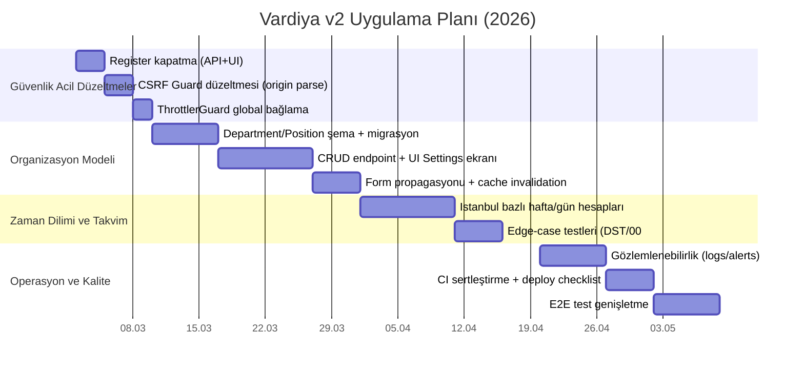

# leskuy7/vardiyav2 Derin Teknik İnceleme ve Üretim Hazırlık Raporu

## Yönetici özeti

Bu çalışma, **leskuy7/vardiyav2** monoreposunu (Next.js + Mantine frontend, NestJS + Prisma backend) kod seviyesinde kapsamlı biçimde denetler; ayrıca kullanıcı mesajında geçen “iki canlı site”den en az birinin kod içinde işaret edildiği görülse de (Next.js rewrite varsayılanı), bu konuşmada **canlı URL’ler açıkça paylaşılmadığı** ve tarama aracı güvenlik kısıtları nedeniyle bu alan adlarına erişim mümkün olmadığı için “canlı ortam” testleri/ekran görüntüleri sınırlı kalmıştır. Buna rağmen, repo içi bulgular üzerinden **somut hata/eksik**, **dosya seviyesinde öneri**, **şema/migrasyon planı**, **API sözleşmesi değişikliği**, **test planı** ve **OWASP Top 10** temelli güvenlik sertleştirmesi içeren uygulanabilir bir yol haritası sunulmuştur. OWASP Top 10:2021, web uygulamalarındaki en kritik risk sınıflarının (Broken Access Control, Injection, Misconfiguration vb.) standart referans listesidir. citeturn15search3

Öne çıkan kritik bulgular:

- **“Kayıt yok, sadece admin oluşturur” gereksinimiyle çelişki:** Backend’de `POST /api/auth/register` endpoint’i mevcut ve sadece “invite code” ile korunuyor; frontend’de login sayfasında “Kayıt” sekmesi var (aksiyonel değil ama UX olarak yanlış yönlendiriyor). Bu akış, ürün kararınızla uyumlu hale getirilmeli (register kaldırılmalı veya sadece ADMIN’e kapatılmalı).  
- **CSRF Guard’da referer doğrulama zafiyeti:** `CsrfGuard` referer doğrulamasını `startsWith` ile yapıyor; bu yaklaşım `https://site.com.attacker.com/...` gibi “prefix” tuzaklarında yanlış pozitif üretebilir. OWASP CSRF Cheat Sheet, origin/referer kontrollerinde hedef origin karşılaştırmasının **tam ve güçlü** yapılması gerektiğini vurgular. citeturn16search0turn16search3  
- **Rate limit yapılandırması eksik uygulanıyor olabilir:** `ThrottlerModule` import ediliyor; ancak `ThrottlerGuard`’ın route’lara bağlanması gerekir (ör. `APP_GUARD`). Bu bağlama yapılmadığında beklenen brute-force koruması devreye girmeyebilir. NestJS rate limiting dokümantasyonu ve throttler README’si, guard binding gerekliliğini açıkça belirtir. citeturn14search2turn14search1  
- **Departman/Pozisyon yönetimi ürün gereksinimini karşılamıyor:** `Employee.department` ve `Employee.position` serbest metin (string) alanları; “eklediğim departman/pozisyon sonraki formlarda listelensin” gereksinimi için **normalize edilmiş tablolar + CRUD endpoint’leri + frontend cache invalidation** tasarlanmalı.  
- **Zaman dilimi (Europe/Istanbul) bütünlüğü riski:** Hem frontend hem backend’de hafta başlangıcı ve gün gruplama mantığı **UTC tabanlı** kurgulanmış; görüntüleme ise Istanbul timeZone ile yapılıyor. Bu, sınır saatlerde (özellikle 00:00 çevresi) vardiyaların yanlış güne düşmesi gibi üretimde zor yakalanan hatalara yol açabilir.

Aşağıdaki bölümler, bu bulguları tek tek kapatacak şekilde; kod değişiklikleri, migrasyonlar, API sözleşmeleri ve test/operasyon kontrol listeleriyle birlikte sunulur.

## Kapsam ve metodoloji

Bu rapor üç kaynaktan beslenir:

- Repo kodu: Backend (NestJS 11 + Prisma 6), Frontend (Next.js 15 + React 19 + Mantine, React Query, Axios), Dockerfile’lar, CI workflow ve test dosyaları.
- Güvenlik/operasyon için birincil dokümanlar: OWASP Top 10:2021 citeturn15search3, OWASP Password Storage Cheat Sheet citeturn15search0, OWASP Session Management Cheat Sheet citeturn15search2, OWASP CSRF Prevention Cheat Sheet citeturn16search1turn16search0, NestJS Rate Limiting citeturn14search2.
- “Canlı ortam” doğrulaması: Bu konuşmada canlı URL’ler verilmediği için ve tarama aracı URL güvenlik kısıtı nedeniyle kodda görülen alan adlarına erişilemediği için, canlı testler yerine **çalıştırılabilir curl/playwright test komutları** ve **üretim checklist’i** verildi.

## Mimari ve kod tabanı yapısı

### Monorepo ve çalışma alanları

Repo bir monorepo yapısında; ana paketler:

- `apps/api`: NestJS uygulaması (JWT auth, employee/shift/schedule/availability/reports modülleri)
- `apps/web`: Next.js uygulaması (Mantine UI, React Query, Axios interceptor ile refresh)

Önemli bir üretim işareti: `apps/web/next.config.ts` içinde `/api/*` istekleri için rewrite tanımı var ve varsayılan hedef olarak `https://vardiyav2-api-production.up.railway.app` kullanılıyor:

- Dosya: `apps/web/next.config.ts`
- Sorun: “default production domain” hard-code edilmiş gibi davranıyor; environment boşsa prod’a yönlenme riski ve yanlış ortamda yanlış backend’e bağlanma ihtimali.  
- Ayrıca bu değer, “iki canlı site”den en az biri olarak backend URL’sini işaret ediyor; ikinci canlı site (web) URL’si ise bu konuşmada mevcut değil.

### Backend modül haritası

Backend ana modüller:

- Auth: `apps/api/src/auth/*`  
  - JWT access token (Bearer) + refresh token (httpOnly cookie)
- Employees: `apps/api/src/employees/*`  
  - ADMIN/MANAGER erişimi, kullanıcı + employee yaratımı
- Shifts/Schedule/Availability/Reports: vardiya yönetimi ve raporlar

### Frontend ana akış

Frontend tarafında:

- Axios instance: `apps/web/src/lib/api.ts` (401’de otomatik refresh, başarısızsa login’e yönlendirme)
- Login ekranı: `apps/web/src/app/login/page.tsx` (demo hesaplar, access token’ı memory’de saklama)
- Haftalık grid bileşenleri: `apps/web/src/components/schedule/weekly-grid.tsx`, `shift-modal.tsx`

## Backend denetimi

### Kimlik doğrulama, oturum ve şifre yönetimi

#### Mevcut durum

- Login:
  - `POST /api/auth/login` → `AuthService.login()` çağrılıyor; response body **sadece** `{ accessToken, user }` dönüyor; refresh token **httpOnly cookie** olarak set ediliyor. (Dosya: `apps/api/src/auth/auth.controller.ts`)
  - Cookie özellikleri: `httpOnly: true`, `secure: prod`, `sameSite: prod? 'none' : 'lax'`, `path: '/api/auth'`, `maxAge: 7 gün`. (Aynı dosya)
- Refresh:
  - `POST /api/auth/refresh` → cookie’den `refresh_token` okunuyor; refresh token doğrulanıp rotate ediliyor. (Aynı dosya)
- Logout:
  - `POST /api/auth/logout` → DB’de `refreshTokenHash` null yapılıyor ve cookie temizleniyor. (Dosya: `apps/api/src/auth/auth.service.ts` + controller)

Şifre saklama:
- Kullanıcı şifresi bcrypt ile hash’leniyor (`bcrypt.hash(..., 12)`). (Dosya: `apps/api/src/auth/auth.service.ts`, `apps/api/src/employees/employees.service.ts`)

#### Sorunlar ve riskler

- **Ürün gereksinimiyle çelişen register endpoint’i:**  
  `POST /api/auth/register` aktif. Invite code kontrolü var; buna rağmen “public registration yok” hedefi için bu endpoint ve DTO/ENV bağımlılıkları kaldırılmalı veya yalnız ADMIN arayüzünden tetiklenebilir hale getirilmeli.
- **Refresh cookie ayarları ve CSRF bağlamı:**  
  Prod’da `sameSite: 'none'` kullanımı (cross-site senaryolar için gerekli olabilir) CSRF riskini yükseltir; bu yüzden CSRF korumasının doğru olması kritik. OWASP CSRF Cheat Sheet, origin/referer doğrulamasında sık yapılan hatalara dikkat çeker. citeturn16search0turn16search1
- **Tek cihaz/tek oturum modeli:**  
  Refresh token hash’i `User.refreshTokenHash` alanında tekil tutuluyor; yeni login eski oturumu düşürür. Bu bazen istenen davranış olabilir; ama “çoklu cihaz” beklentisi varsa session tablosuna geçmek gerekir.
- **Şifre politikası minimum:**  
  DTO’larda sadece `MinLength(8)` var. OWASP Password Storage Cheat Sheet, güçlü hash seçimi ve uygun parametrelerle birlikte, brute-force riskini azaltmak için doğru stratejileri önerir. Argon2id ilk tercihtir; bcrypt “legacy” seçenektir ve cost factor minimum 10+ önerilir. citeturn15search0

#### Öncelikli aksiyonlar

“Public registration yok” hedefine uygun seçenekler:

**Seçenek A (önerilen): register akışını tamamen kaldır**
- Backend:
  - `apps/api/src/auth/auth.controller.ts`: `@Post('register')` metodunu kaldır.
  - `apps/api/src/auth/auth.service.ts`: `register()` metodunu kaldır veya yalnız “bootstrap” için private hale getir.
  - `apps/api/src/main.ts`: `validateRequiredEnv()` içinden `REGISTER_INVITE_CODE` zorunluluğunu kaldır.
  - DTO: `apps/api/src/auth/dto/register.dto.ts` kullanımını temizle.
- Frontend:
  - `apps/web/src/app/login/page.tsx`: “Kayıt” sekmesini kaldır, yerine “Hesaplar yalnız admin tarafından oluşturulur” bilgilendirmesi koy.

**Seçenek B: register kalsın ama sadece ADMIN**
- `POST /api/auth/register` endpoint’ini `JwtAuthGuard + RolesGuard` ile yalnız `ADMIN` erişimine aç; invite code’u tamamen kaldır. Böylece “admin kullanıcı oluşturma” için tek endpoint olur.

Şifre saklamada iyileştirme seçenekleri:

- **Argon2id’e geçiş (önerilen)**: OWASP en çok Argon2id’i önerir. citeturn15search0  
- Bcrypt’te kalınacaksa:
  - **maksimum şifre uzunluğu** (bcrypt 72 byte limiti) + complexity politikası + rate limit + brute-force tespiti eklenmeli. citeturn15search0

Örnek (Argon2id) kod değişimi:

```ts
// apps/api/src/auth/auth.service.ts ve apps/api/src/employees/employees.service.ts
import * as argon2 from 'argon2';

// hash
const passwordHash = await argon2.hash(dto.password, {
  type: argon2.argon2id,
  memoryCost: 19 * 1024, // ~19 MiB (OWASP minimum)
  timeCost: 2,
  parallelism: 1,
});

// verify
const ok = await argon2.verify(user.passwordHash, dto.password);
```

### CSRF, CORS ve güvenli cookie

#### Mevcut durum

- CORS:
  - `apps/api/src/main.ts` içinde `WEB_ORIGIN` (virgülle ayrılabilen liste) allowlist olarak kullanılıyor; `credentials: true`.  
- CSRF Guard:
  - `apps/api/src/common/auth/csrf.guard.ts` state-changing method’larda `CSRF_ORIGIN` ile `Origin` veya `Referer` kontrolü yapıyor.

OWASP, Origin/Referer tabanlı doğrulamanın “defense-in-depth” olabileceğini; ancak hedef origin kontrolünün **tam** yapılması gerektiğini belirtir. citeturn16search0turn16search3

#### Kritik sorun

`CsrfGuard` içinde:

```ts
const refererOk = Boolean(referer?.startsWith(allowedOrigin));
```

Bu yaklaşım, `https://site.com.attacker.com/...` gibi bir referer’da `startsWith("https://site.com") === true` olacağı için **yanlış pozitif** üretebilir. OWASP, `site.com.attacker.com` gibi superset alan adlarıyla kandırılabilecek hatalı karşılaştırmalara özellikle dikkat çeker. citeturn16search0turn16search3

#### Önerilen düzeltme

- Çoklu origin desteği (CSRF için de allowlist)
- `URL` parse ederek **origin eşitliği** kontrolü

```ts
// apps/api/src/common/auth/csrf.guard.ts
function normalizeOrigin(url: string) {
  const u = new URL(url);
  return `${u.protocol}//${u.host}`; // host includes port
}

const allowed = (this.config.get<string>('CSRF_ORIGINS') ?? '')
  .split(',')
  .map(s => s.trim())
  .filter(Boolean)
  .map(normalizeOrigin);

const origin = request.headers.origin;
const referer = request.headers.referer;

const originOk = origin ? allowed.includes(normalizeOrigin(origin)) : false;
const refererOk = referer ? allowed.includes(normalizeOrigin(referer)) : false;

if (!originOk && !refererOk) throw new UnauthorizedException(...);
```

Ek öneriler:
- Prod’da refresh cookie için `__Host-` veya `__Secure-` prefix değerlendirin (domain hijack riskini azaltır; ancak `__Host-` için `Path=/` zorunluluğu gibi kısıtlar vardır). OWASP Session Management rehberi cookie güvenlik bayraklarını ve oturum ID korunmasını ayrıntılandırır. citeturn15search2  
- `CORS` origin allowlist’i ile `CSRF` origin allowlist’i aynı kaynaktan yönetilmeli (tek env, tek doğrulama).

### Rate limiting ve brute-force koruması

#### Mevcut durum

`apps/api/src/app.module.ts` içinde `ThrottlerModule` konfigüre ediliyor; fakat repo genelinde `ThrottlerGuard`’ın `APP_GUARD` ile global bağlandığına dair bir kanıt yok.

NestJS dokümantasyonu ve throttler README’si; throttling’in route’larda çalışması için guard’ın bağlanması gerektiğini ve “global guard” için `APP_GUARD` örneğini verir. citeturn14search2turn14search1

#### Önerilen düzeltme

```ts
// apps/api/src/app.module.ts
import { APP_GUARD } from '@nestjs/core';
import { ThrottlerGuard } from '@nestjs/throttler';

@Module({
  imports: [
    // mevcut ThrottlerModule.forRootAsync...
  ],
  providers: [
    { provide: APP_GUARD, useClass: ThrottlerGuard },
  ],
})
export class AppModule {}
```

Ayrıca login endpoint’i için daha sıkı limit:

```ts
// apps/api/src/auth/auth.controller.ts
import { Throttle } from '@nestjs/throttler';

@Post('login')
@Throttle({ default: { limit: 5, ttl: 60_000 } })
async login(...) { ... }
```

Bu yaklaşım, OWASP Top 10’daki “Identification and Authentication Failures” risk sınıfını azaltmaya doğrudan katkı sağlar. citeturn15search3

### Yetkilendirme ve kapsam kontrolü

#### Mevcut durum

- Employees endpoint’leri `@Roles('ADMIN','MANAGER')` ile sınırlı. (Dosya: `apps/api/src/employees/employees.controller.ts`)
- Shifts ve schedule listeleri role bazlı değil; ancak `getEmployeeScope()` ile iç mantıkta filtreleme yapılıyor. (Dosya: `apps/api/src/common/employee-scope.ts`)

#### Dikkat edilmesi gereken davranış

`getEmployeeScope()` içinde EMPLOYEE rolü ve departmanı olan çalışanlara `type: 'department'` scope veriliyor. Bu tasarım, çalışanların kendi departmanındaki diğer çalışanların vardiyalarını görmesini sağlayabilir. Bu, sizin iş kuralınıza göre “istenen” veya “veri sızıntısı” olabilir.

**Öneri:** Ürün kararına göre iki seçenek:
- **Sıkı mod (önerilen varsayılan):** EMPLOYEE daima “self” scope görsün (sadece kendi vardiyaları).
- **Takım görünürlüğü:** Takım vardiyası görünürlüğü “opt-in” bir izinle açılmalı (örn. `Employee.canViewTeamSchedule`).

Bu karar, OWASP Top 10 “Broken Access Control” (A01) risk alanıyla ilişkilidir. citeturn15search3

### Zaman dilimi doğruluğu

#### Mevcut durum

- Backend hafta başlangıcını `YYYY-MM-DDT00:00:00.000Z` olarak parse ediyor. (Dosya: `apps/api/src/common/time.utils.ts`)
- Frontend hafta başlangıcını `getUTCDay()` üzerinden hesaplıyor. (Dosya: `apps/web/src/lib/time.ts`)
- UI gösterimi Istanbul timeZone ile yapılıyor. (Dosya: `apps/web/src/lib/time.ts`)
- Shift template saatleri `setUTCHours` ile kuruluyor. (Dosya: `apps/web/src/components/schedule/shift-modal.tsx`)

Bu kombinasyon, “Istanbul yerel takvim” bekleniyorsa mantıksal tutarsızlığa yol açabilir: veri UTC gün sınırlarına göre gruplanır ama kullanıcıya TR saat diliminde gösterilir.

#### Önerilen çözüm yaklaşımı

- Sistem genelinde “iş saat dilimi”ni tek bir sabit olarak tanımlayın: `Europe/Istanbul`
- Backend’de hafta sınırlarını ve günü `Luxon`/`date-fns-tz` ile Istanbul’a göre hesaplayıp UTC’ye çevirin.
- Frontend’de template oluştururken `setHours` (local) kullanın veya timeZone-aware bir yardımcı yapı kurun.
- API sözleşmesine “weekStart” parametresinin hangi timeZone’a göre yorumlandığını açıkça yazın.

Bu değişiklik “Insecure Design” değil ama üretimde en çok sorun çıkaran “gizli bug” sınıfıdır; testle yakalanması gerekir.

### Veri modelleri ve departman/pozisyon yönetimi

#### Mevcut durum

- `Employee.position` ve `Employee.department` alanları serbest metin olarak kullanılıyor (EmployeesService create/update bunu direkt set ediyor). (Dosya: `apps/api/src/employees/employees.service.ts`)
- “Departman/Pozisyon eklediğimde sonraki formlarda görünsün” gereksinimi için:
  - DB’de ayrı tablolar yok
  - API’de listeleme/CRUD endpoint’i yok
  - Frontend’de select seçenekleri için merkezi kaynak yok

#### Önerilen hedef durum

Departman ve pozisyonu normalize edin:

- `Department` tablosu (id, name, isActive, createdAt…)
- `Position` tablosu (id, name, isActive, createdAt…)
- `Employee.departmentId`, `Employee.positionId` foreign key

Böylece:
- Tutarlı yazım (Ops / OPS / ops) problemi çözülür
- Formlar select ile beslenir
- Yetkilendirme (team scope) daha güvenilir hale gelir (string eşleşmesine dayanmaz)
- Raporlama/filtreleme doğru yapılır

## Frontend denetimi

### Login ve “kayıt yok” UX uyumu

#### Mevcut durum

`apps/web/src/app/login/page.tsx` içinde “Giriş / Kayıt” sekmeleri var; kayıt sekmesi sadece bilgi mesajı gösteriyor. Bu, kullanıcıya “yakında kayıt açılacak” mesajı veriyor; ama sizin gereksiniminiz bunun tam tersi: “kayıt olmayacak, admin hesap açacak”.

#### Önerilen düzenleme

- “Kayıt” sekmesini kaldırın.
- Login formunun altına küçük bir açıklama ekleyin:
  - “Hesaplar yalnızca sistem yöneticisi tarafından oluşturulur.”
- Demo hesaplar development/demo ortamı için iyi; prod’da feature-flag ile kapatın.

### Haftalık plan grid’i, responsive ve erişilebilirlik

#### Mevcut durum

`WeeklyGrid` bileşeni tablo tabanlı ve her hücre `minWidth: 250` ile geliyor, yatay scroll var. (Dosya: `apps/web/src/components/schedule/weekly-grid.tsx`) Bu, desktop’ta iyi; mobilde ise yoğun scroll/drag-drop zor olabilir.

Drag-drop (dnd-kit) ile taşımada klavye erişilebilirliği ve screen reader desteği varsayılan olarak zayıf olabilir.

#### Öneriler

- Mobil görünüm için alternatif “Gün kartları”:
  - Üstte gün seçici (segmented control)
  - Altta çalışanlara göre vardiya listesi
- Drag-drop’a ek olarak “Move” aksiyonu:
  - ShiftCard menüsünde “Başka güne taşı” modalı
- Erişilebilirlik:
  - Sürükle-bırak yerine klavye ile seçim + hedef seçme akışı (WCAG uyumu hedeflenmeli)
- Performans:
  - Haftalık toplam saat hesapları her render’da reduce ile dönüyor; veri büyürse memoize edin.

### Shift modal UX

`ShiftModal`:
- Template butonları iyi (Sabah/Öğle/Gece). (Dosya: `apps/web/src/components/schedule/shift-modal.tsx`)
- Ancak saatlerin `UTC` kurulması, İstanbul saat dilimi beklentisiyle uyuşmayabilir (backend bölümündeki timeZone maddesi).

Öneri:
- Template hesaplarında `setHours` kullanın veya dayjs/luxon ile local date oluşturun.
- “Override” checkbox’ı için net uyarı:
  - “Müsaitlik kuralı ihlal ediliyor, sadece yönetici onayıyla…”

### Departman/Pozisyon CRUD ve form propagasyonu

Hedef akış (önerilen):

- **Ayarlar → Organizasyon**
  - Departmanlar (liste + ekle/düzenle/pasif et)
  - Pozisyonlar (liste + ekle/düzenle/pasif et)
- **Çalışan Oluştur/Düzenle formu**
  - Departman: Select (API’den)
  - Pozisyon: Select (API’den)
  - “Yeni departman ekle” mini modal (inline create)
- React Query:
  - `useDepartments()`, `usePositions()` query’leri
  - CRUD sonrası ilgili query invalidate

Bu şekilde “ekledim, sonraki formda görünmüyor” problemi tasarımsal olarak kapanır.

## Güvenlik, operasyon, dağıtım ve ölçeklenebilirlik

### OWASP Top 10 eşlemesi ve öneriler

OWASP Top 10:2021 listesi, uygulama risklerini sınıflandırmak için temel referanstır. citeturn15search3

Bu projeye özel “yük taşıyan” başlıklar:

- **A01 Broken Access Control:** Employee scope kararları (self vs department), admin/manager ayrıcalıkları, endpoint korumalarının tutarlılığı. citeturn15search3  
- **A05 Security Misconfiguration:** CORS/CSRF allowlist uyumsuzluğu, swagger’ın prod’da kontrolsüz açık olması, varsayılan API domain fallback’ları. citeturn15search3  
- **A07 Identification and Authentication Failures:** Register akışı (ürün kararıyla uyumsuz), rate limiting’in guard’a bağlanmaması riski, şifre politikası ve brute force koruması. citeturn15search3turn14search2  
- **A09 Security Logging and Monitoring Failures:** Audit log var; ancak merkezi yapılandırma, alarm, korelasyon id, prod gözlemlenebilirlik eksikleri. citeturn15search3

### Şifre saklama ve parola politikası

OWASP Password Storage Cheat Sheet:
- İlk tercih: **Argon2id**; yoksa scrypt; bcrypt legacy. citeturn15search0  
- Bcrypt kullanılıyorsa:
  - cost ≥ 10
  - 72 byte limitine dikkat

Bu projede bcrypt (cost=12) kullanımı kabul edilebilir; ama uzun vadede Argon2id’e geçiş ve parola politikası eklenmesi daha doğru.

### Oturum yönetimi ve session invalidation

OWASP Session Management Cheat Sheet, session token’larının “en güçlü kimlik doğrulama faktörü” gibi korunması gerektiğini vurgular. citeturn15search2

Bu projede:
- Refresh token cookie’de → doğru yaklaşım
- Access token memory’de → XSS’e karşı görece daha iyi (localStorage’dan iyi), ama sayfa yenilemede token kaybı; refresh ile toparlanır.

Ek öneriler:
- Refresh token rotate edilirken “tekil session” yerine çoklu session istenirse:
  - `UserSession` tablosu + `sessionId` + revoke list
- Logout sonrası access token invalidation isteniyorsa:
  - Kısa access expiry (zaten 15m default) + refresh iptali çoğu senaryoda yeterli
  - Daha katı ihtiyaçta: `jti` + Redis blacklist

### CI/CD, dağıtım ve veri tabanı migrasyonları

Mevcut repo CI dosyası mevcut (GitHub Actions). Ancak prod’a “güvenli deploy” için şu standartlar önerilir:

- DB değişiklikleri için **Prisma migrate** (db push yerine) kullanın:
  - Dev: `prisma migrate dev`
  - Prod: `prisma migrate deploy`
- “Seed-prod” script’lerinin prod secret/credential üretmemesi, idempotent olması
- Docker image optimizasyonu:
  - Build stage’de devDependencies, runner stage’de yalnız prod deps

### Loglama/izleme, alarmlar, yedekleme

- Loglama:
  - NestJS Logger yeterli başlangıç; prod’da JSON structured logging (pino/winston) + request-id ekleyin.
- İzleme:
  - Health endpoint’i şu an yalnız “ok/uprtime” dönüyor; DB bağlantısını da doğrulayan `/health/db` gibi bir alt-check ekleyin.
- Yedekleme:
  - DB türü “unspecified” kabul edilse de Prisma kullanımında en yaygın senaryo Postgres’tir; yönetilen DB kullanılıyorsa günlük snapshot/point-in-time recovery açılmalı.
- Uyarı:
  - Auth brute-force (çok 401) alarmı
  - 5xx oranı alarmı
  - DB bağlantı havuzu saturation alarmı

## Migrasyon planı, API sözleşmesi, test stratejisi ve yol haritası

### Departman/Pozisyon için veri migrasyonu planı

Hedef: `Employee.department/position` string alanlarından `Department/Position` tablolarına geçiş.

Aşamalı (backward-compatible) plan:

- Aşama: Şema ekleme (kırmadan)
  - `Department`, `Position` tablolarını ekle
  - `Employee.departmentId`, `Employee.positionId` alanlarını nullable olarak ekle
  - API response’larda hem legacy string hem yeni ilişkiyi döndür (geçiş süreci)

- Aşama: Veri backfill
  - Mevcut employee kayıtlarından distinct departman/pozisyon adlarını yeni tablolara yaz
  - Employee’leri name→id eşlemesiyle update et

Örnek Postgres SQL (şema Postgres varsayımıyla; farklı DB’de uyarlama gerekir):

```sql
-- Departments
INSERT INTO "Department" ("id", "name")
SELECT gen_random_uuid(), e."department"
FROM "Employee" e
WHERE e."department" IS NOT NULL AND e."department" <> ''
GROUP BY e."department"
ON CONFLICT ("name") DO NOTHING;

UPDATE "Employee" e
SET "departmentId" = d."id"
FROM "Department" d
WHERE e."department" = d."name" AND e."departmentId" IS NULL;

-- Positions
INSERT INTO "Position" ("id", "name")
SELECT gen_random_uuid(), e."position"
FROM "Employee" e
WHERE e."position" IS NOT NULL AND e."position" <> ''
GROUP BY e."position"
ON CONFLICT ("name") DO NOTHING;

UPDATE "Employee" e
SET "positionId" = p."id"
FROM "Position" p
WHERE e."position" = p."name" AND e."positionId" IS NULL;
```

- Aşama: API sözleşmesi güncelleme
  - `POST /employees` ve `PATCH /employees/:id` payload’larına `departmentId`, `positionId` ekle
  - Frontend formları select ile bu id’leri gönderecek
- Aşama: Legacy alanları temizleme
  - Tüm client’lar yeni alanı kullanınca string alanlar kaldırılabilir veya sadece “display cache” olarak bırakılabilir.

### API sözleşmesi değişikliği önerisi

Departman/pozisyon CRUD:

- `GET /departments` → `[ { id, name, isActive } ]`
- `POST /departments` (ADMIN) → create
- `PATCH /departments/:id` (ADMIN) → rename/activate
- `GET /positions` … aynı

Employee payload güncellemesi:

- `CreateEmployeeDto` içine:
  - `departmentId?: string`
  - `positionId?: string`
- Response içine:
  - `department?: { id, name } | null`
  - `position?: { id, name } | null`

Register kaldırma:
- `POST /auth/register` kaldırılırsa API dokümantasyonu ve frontend temizlenir.

### Test planı

Birincil hedef: regresyon ve güvenlik polisini otomatik yakalamak.

Backend (Jest + supertest):

- Auth:
  - Login rate limit testi (5/60s gibi)
  - Refresh cookie set/rotate testi
  - Logout sonrası refresh’in 401 dönmesi
- CSRF:
  - `Referer` prefix bypass testi (bug fix doğrulaması)
  - Çoklu origin allowlist testi
- RBAC:
  - EMPLOYEE sadece kendi vardiyasını görebilir (veya ürün kararınıza göre departman)
- Org yönetimi:
  - Department create → employee form alanlarına yansır (API seviyesinde: GET /departments sonrası yeni kayıt görünür)

Frontend (Playwright):

- Login → dashboard → çalışan oluşturma
- Departman ekle → çalışan formunda departman seçeneklerinde görünür
- Mobile viewport smoke test (en azından sayfalar açılıyor mu)

OWASP yönergeleri, oturum yönetimi testlerinin (session creation/expiration, cookie flags) kritik olduğunu vurgular. citeturn15search2

### Üretim kontrol listesi

- Secrets:
  - JWT secrets, DB URL, CSRF allowlist
- HTTP güvenliği:
  - TLS zorunlu (HSTS değerlendirin)
  - CORS allowlist tight
  - CSRF guard doğru origin karşılaştırması
- Auth:
  - Register kapalı
  - Rate limit aktif (guard bağlı)
- Veri:
  - Prisma migrate deploy
  - Backup planı (günlük)
- Gözlemlenebilirlik:
  - error tracking + log aggregation
  - 5xx alarmı, auth brute-force alarmı

### Önceliklendirilmiş yol haritası ve efor tahmini

Aşağıdaki tablo, “mevcut → önerilen” dönüşümüyle birlikte priorite verir:

| Alan | Mevcut durum | Önerilen hedef | Öncelik | Efor |
|---|---|---|---|---|
| Public registration | Register endpoint mevcut, login UI “Kayıt” gösteriyor | Register kaldır (veya sadece ADMIN) | Kritik | Düşük |
| CSRF referer kontrolü | `startsWith` ile bypass riski | URL parse + exact origin match + allowlist | Kritik | Düşük |
| Rate limiting | ThrottlerModule var, guard binding belirsiz | `APP_GUARD` ile ThrottlerGuard + login throttle | Yüksek | Düşük |
| Departman/Pozisyon | String alanlar, CRUD yok | Normalize tablo + CRUD + form propagasyonu | Yüksek | Orta |
| Timezone | UTC hesap + TR gösterim karışık | Europe/Istanbul bazlı hesap + net sözleşme | Yüksek | Orta/Yüksek |
| Observability | Temel logger/audit var | Structured log + metrics + alert | Orta | Orta |
| DB migrasyon | Yöntem tam net değil | Prisma migrate standardizasyonu | Orta | Orta |

Önerilen faz planı (Mermaid):



### Canlı ortam testleri için çalıştırılabilir komutlar

Bu raporda canlı URL’lere erişim olmadığından, sizdeki iki canlı URL için aşağıdaki komutları doğrudan çalıştırarak doğrulama yapabilirsiniz (örnekler placeholder):

```bash
# Health
curl -i https://<API_DOMAIN>/api/health

# Login (CSRF gerektirmez)
curl -i -X POST https://<API_DOMAIN>/api/auth/login \
  -H 'Content-Type: application/json' \
  -d '{"email":"admin@...","password":"..."}'
# Set-Cookie: refresh_token=...; HttpOnly; Secure; SameSite=...

# Refresh (CSRF/Origin gerektirir)
curl -i -X POST https://<API_DOMAIN>/api/auth/refresh \
  -H 'Origin: https://<WEB_DOMAIN>' \
  --cookie "refresh_token=<TOKEN>"

# Yetki kontrolü (access token ile)
curl -i https://<API_DOMAIN>/api/employees?active=true \
  -H "Authorization: Bearer <ACCESS_TOKEN>"
```

Bu doğrulamalar; kimlik doğrulama, oturum cookie güvenliği ve CORS/CSRF davranışını hızlıca görünür kılar. OWASP session yönetimi rehberi, cookie güvenlik bayraklarının ve token yaşam döngüsünün doğru test edilmesini önerir. citeturn15search2