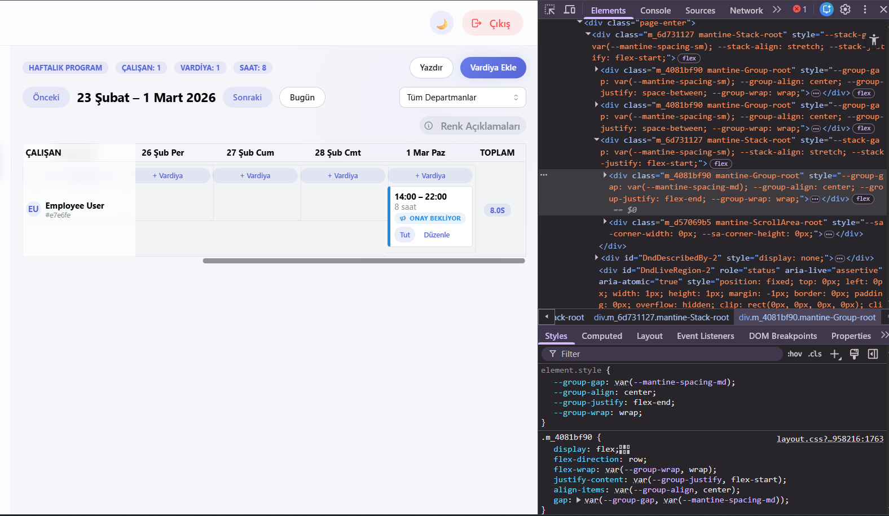
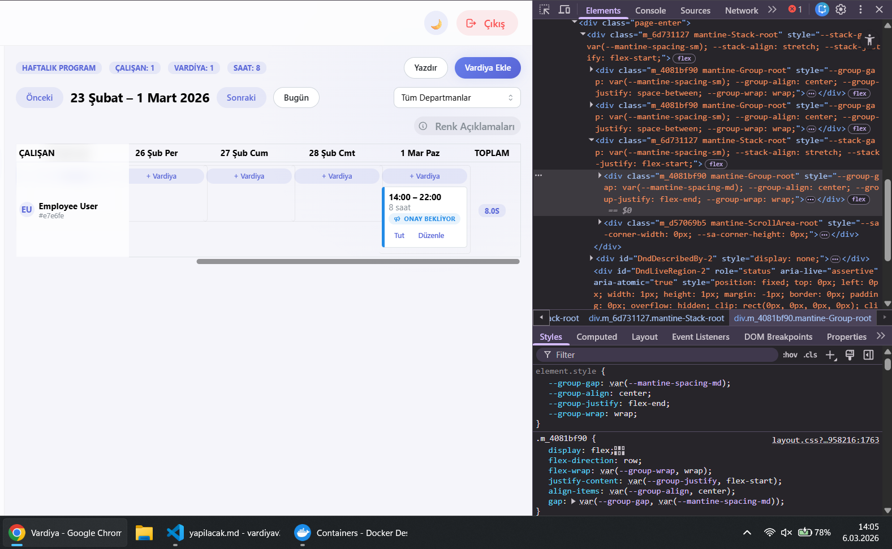

# leskuy7/vardiyav2 Derin Kod İncelemesi: “Bu kod çalışırken nerede bozulabilir?”

## İnceleme kapsamı ve yaklaşım

Bu inceleme, `leskuy7/vardiyav2` monoreposundaki **Next.js (apps/web)** ve kritik etkileşim noktaları nedeniyle **NestJS + Prisma (apps/api)** tarafını kapsar. Amaç; “çalışıyor gibi görünse bile” üretimde/gerçek kullanıcı akışında kırılabilecek yerleri yakalamak: auth/refresh akışı, event-handler’lar, state/async mantığı, API sözleşmesi uyumsuzlukları, tarayıcıda hata çıkarabilecek kodlar ve rol/izin kapsamı hataları.

Analiz sırasında özellikle şu iki başlık sürekli test edildi (zihinsel model olarak):  
1) “Bu anomali ne zaman ortaya çıkar?” (örn. token expire, gece vardiyası, cross-day, mobil sürükle-bırak)  
2) “Hata olduğunda kullanıcıya ne görünür?” (white screen, sonsuz redirect, 401 döngüsü, yanlış rapor, sessiz başarısızlık)

## En kritik kırılma senaryoları

Uygulamada “sessiz ama büyük” iki risk öne çıkıyor:

Birincisi, **401 → refresh → retry** zinciri: URL normalize etme ile refresh çağrısını tespit etme mantığı birbiriyle çeliştiği için, bazı durumlarda refresh isteği refresh ile tekrar tetiklenerek **sonsuz döngü / spam istek / aniden logout** üretme riski taşıyor. Bu akış doğrudan `apps/web/src/lib/api.ts` içinde gerçekleşiyor. fileciteturn46file0L28-L80

İkincisi, **zaman dilimi (Europe/Istanbul) vs UTC** karışımı: “Availability” blokları saat bazında **string** tutuluyor ama shift zamanları **timestamptz**. Hem frontend hem backend tarafında “dakika hesaplama” UTC saatleriyle yapıldığı için, özellikle Türkiye saatinde vardiya planlama/çakışma kontrolü **3 saat kaymış** çalışabilir; bazı gün/saatlerde “müsait değil” blokları uygulanmaz, bazı günlerde yanlış engel çıkar. (Bu, üretimde “plan var ama sistem yanlış uyarıyor/uyarmıyor” türü en pahalı bug sınıfıdır.) fileciteturn36file2L11-L65 fileciteturn32file1L95-L105 fileciteturn38file0L203-L290

Aşağıda her bulgu için istediğiniz formatta (SORUN / NEDEN / ÇÖZÜM / DÜZELTİLMİŞ KOD) detaylı şekilde ilerliyorum.

## Kimlik doğrulama ve API iletişimi hataları

SORUN:
```ts
// apps/web/src/lib/api.ts
const envApiUrl =
  process.env.NEXT_PUBLIC_API_URL ??
  (process.env.NEXT_PUBLIC_API_BASE
    ? `${process.env.NEXT_PUBLIC_API_BASE.replace(/\/$/, '')}/api`
    : '/api');
const API_URL = envApiUrl.endsWith('/') ? envApiUrl : `${envApiUrl}/`;
```  
İlgili kod: `NEXT_PUBLIC_API_URL` “boş string” ise bile `??` yüzünden fallback’e düşmüyor. fileciteturn46file0L6-L12

NEDEN:  
README’de `NEXT_PUBLIC_API_URL` için “boş bırakılabilir” denmiş. fileciteturn43file0L52-L54  
Pratikte bazı CI/Vercel/Railway yapılandırmalarında env değişkeni **tanımlı ama boş** gelebilir (ör. `NEXT_PUBLIC_API_URL=""`). `??` operatörü boş string’i “değer var” saydığı için `envApiUrl = ""` olur ve `API_URL` sonuçta `"/"` olur. Bu durumda axios baseURL “site kökü”ne kayar: `/auth/me` yerine `/auth/me` site origininde aranır, rewrite varsa bile bozulabilir. Bu, prod’da “API tamamen çalışmıyor, her şey 404/401” gibi görünür ve debug’ı zordur.

ÇÖZÜM:  
`NEXT_PUBLIC_API_URL` değerini `.trim()` edip **boşsa fallback** kullanın. Yani `??` yerine “boş string’i de yakalayan” bir mantık kurun.

DÜZELTİLMİŞ KOD:
```ts
// apps/web/src/lib/api.ts
const apiUrlRaw = (process.env.NEXT_PUBLIC_API_URL ?? '').trim();

const envApiUrl =
  apiUrlRaw ||
  (process.env.NEXT_PUBLIC_API_BASE
    ? `${process.env.NEXT_PUBLIC_API_BASE.replace(/\/$/, '')}/api`
    : '/api');

const API_URL = envApiUrl.endsWith('/') ? envApiUrl : `${envApiUrl}/`;
```

---

SORUN:
```ts
// apps/web/src/lib/api.ts
// Request interceptor:
if (config.url && config.url.startsWith('/')) {
  config.url = config.url.substring(1);
}

// Response interceptor:
const isRefreshCall = originalRequest?.url?.includes('/auth/refresh');
...
refreshPromise = api.post('/auth/refresh')
```  
Bir tarafta URL başındaki `/` kaldırılıyor, diğer tarafta refresh tespiti `'/auth/refresh'` arıyor. fileciteturn46file0L28-L66

NEDEN:  
Bu çelişki yüzünden `originalRequest.url` pratikte çoğu zaman `"auth/refresh"` (başında slash yok) olur. O zaman:

- `isRefreshCall` yanlışlıkla `false` kalır. fileciteturn46file0L47-L56  
- Refresh endpoint’i (kendisi) 401 aldığında bile “refresh olmayan 401” gibi ele alınır ve tekrar refresh tetiklenebilir.  
- Bu da bazı hata koşullarında (özellikle CSRF blok, refresh cookie yok, refresh token invalidate) **sonsuz refresh denemesi**, art arda 401, kullanıcı tarafında sürekli login’e atma, bazen de “request never resolves” ile sayfanın takılı kalması gibi sonuçlar üretir.

Bu, “kod genelde çalışıyor ama bazen her şey çöküyor” sınıfı **gizli bug**tur.

ÇÖZÜM:  
Refresh çağrısını tespit ederken URL’yi her iki durumu kapsayacak şekilde normalize edin (başta `/` olsa da olmasa da). Ek olarak refresh için ayrı bir axios instance kullanmak (interceptor’sız) bu tip döngüleri tamamen önler.

DÜZELTİLMİŞ KOD:
```ts
// apps/web/src/lib/api.ts
function normalizePath(url?: string) {
  return (url ?? '').replace(/^\//, '');
}

api.interceptors.response.use(
  (response) => response,
  async (error: AxiosError) => {
    const originalRequest = error.config as RetryableRequestConfig | undefined;
    const reqPath = normalizePath(originalRequest?.url);
    const isRefreshCall = reqPath.startsWith('auth/refresh');

    if (!originalRequest || error.response?.status !== 401 || originalRequest._retry) {
      return Promise.reject(error);
    }

    if (isRefreshCall) {
      forceLogout();
      return Promise.reject(error);
    }

    originalRequest._retry = true;

    if (!refreshPromise) {
      refreshPromise = api
        .post('auth/refresh') // burada leading slash'a gerek yok; zaten normalize ediyorsunuz
        .then((res) => {
          const token = (res.data as any).accessToken as string;
          setAccessToken(token);
          return token;
        })
        .finally(() => {
          refreshPromise = null;
        });
    }

    try {
      const token = await refreshPromise;
      originalRequest.headers = originalRequest.headers ?? ({} as any);
      originalRequest.headers.Authorization = `Bearer ${token}`;
      return api(originalRequest);
    } catch (refreshError) {
      forceLogout();
      return Promise.reject(refreshError);
    }
  }
);
```

---

SORUN:
Backend tarafında CSRF Guard “unsafe” metodlarda (POST/PUT/PATCH/DELETE) **Origin/Referer allowlist** ister; allowlist boşsa direkt 401 atar:  
```ts
// apps/api/src/common/auth/csrf.guard.ts
if (allowed.length === 0) {
  throw new UnauthorizedException({ code: 'CSRF_BLOCKED', message: 'CSRF_ORIGINS is not configured' });
}
...
if (!originOk && !refererOk) {
  throw new UnauthorizedException({ code: 'CSRF_BLOCKED', message: 'Origin/Referer check failed' });
}
``` fileciteturn42file0L20-L45

Ve `POST /auth/refresh` CSRF Guard ile korunuyor: fileciteturn42file1L48-L64

NEDEN:  
Bu tasarım güvenlik açısından mantıklı olsa da “konfigürasyon hatasında” uygulamayı pratikte kırıyor:

- CSRF_ORIGINS yanlış/boş ise refresh her zaman 401 döner → frontend interceptor refresh’i deneyip başarısız olur → `forceLogout()` ile kullanıcı login’e atılır. fileciteturn46file0L36-L80  
- Bu hata çoğu ekipte “prod deploy oldu ama login sonrası 10-15 dk sonra herkes atılıyor” şeklinde raporlanır (access token expire olunca patlar). README’de CSRF mitigasyonu vurgulanmış, yani prod’da kritik bir çalışma şartı. fileciteturn43file0L89-L93

ÇÖZÜM:  
İki katmanlı iyileştirme öneriyorum:

1) **Operasyonel**: Deploy pipeline’da CSRF_ORIGINS’i hem `WEB_ORIGIN` hem de olası domain’lerle doğru set ettiğinizi assert edin.  
2) **Ürün davranışı**: Frontend’de `CSRF_BLOCKED` kodunu yakalayıp “Sistem konfigürasyonu eksik” gibi daha açıklayıcı bir hata gösterin (en azından admin’e).

DÜZELTİLMİŞ KOD (frontend tarafında hata mesajını zenginleştirme örneği):
```ts
// api.ts içinde refreshError catch bloğunda
} catch (refreshError: any) {
  const code = refreshError?.response?.data?.code;
  if (code === 'CSRF_BLOCKED') {
    console.error('CSRF ayarı eksik/hatalı: CSRF_ORIGINS kontrol edin.', refreshError);
  }
  forceLogout();
  return Promise.reject(refreshError);
}
```

---

SORUN:
Protected layout token kontrolünü sadece `isError` değişince koşuyor:
```ts
useEffect(() => {
  if (typeof window === 'undefined') return;
  if (!getAccessToken() || isError) router.replace('/login');
}, [isError, router]);
``` fileciteturn46file2L32-L35

NEDEN:  
`getAccessToken()` localStorage okuyor ama bu effect’in dependency listesinde token yok. Token dışarıdan (ör. başka tab logout, storage clear, forceLogout) değişirse `isError` değişmiyorsa redirect gecikebilir. Bu bazen “korumalı sayfada boş/yarım UI” gibi edge-case’lere gider. Ayrıca `isError` true olduğunda render `null` dönüyor; redirect gecikirse kullanıcı “beyaz ekran” görür. fileciteturn46file2L44-L50

ÇÖZÜM:  
Access token’ı state ile takip etmek veya event-based yaklaşım kullanmak (storage event). Minimum iyileştirme olarak, effect’i `pathname` ya da “auth state” değişimlerinde de tetikleyin ve `isError` durumunda kullanıcıya kısa bir fallback UI verin.

DÜZELTİLMİŞ KOD (minimal):
```ts
useEffect(() => {
  if (typeof window === 'undefined') return;

  const check = () => {
    if (!getAccessToken() || isError) router.replace('/login');
  };

  check();
  window.addEventListener('storage', check);
  return () => window.removeEventListener('storage', check);
}, [isError, router]);
```

## Zaman dilimi ve tarih/saat mantık hataları

SORUN:
Frontend’de availability çakışma hesabı UTC saatleriyle yapılıyor:
```ts
function toMinutes(d: Date): number {
  return d.getUTCHours() * 60 + d.getUTCMinutes();
}
...
const day1 = startAt.getUTCDay();
const shiftStart1 = toMinutes(startAt);
``` fileciteturn36file2L11-L53

Backend’de de benzer şekilde shift saatleri UTC üzerinden dakikaya çevriliyor:
```ts
private toMinutes(isoDate: Date) {
  return isoDate.getUTCHours() * 60 + isoDate.getUTCMinutes();
}
``` fileciteturn32file1L95-L97

Ama availability blokları DB’de saat olarak string tutuluyor:
```prisma
model AvailabilityBlock {
  ...
  startTime  String?
  endTime    String?
}
``` fileciteturn38file0L274-L290  
Shift zamanları ise `timestamptz` (UTC anı) olarak tutuluyor: fileciteturn38file0L203-L208

NEDEN:  
Bu yapı “aynı referans sisteminde” karşılaştırma gerektirir. Şu anki yaklaşım ise:

- Shift zamanını UTC dakikaya çeviriyor (İstanbul için 3 saat geri).  
- Availability “09:00–17:00” gibi değerleri ise yerel saat olarak giriliyor (UI TimeInput bunun için var). fileciteturn37file0L72-L75  
Sonuç: 09:00 İstanbul vardiyası, UTC’de 06:00 gibi değerlendirilir ve availability çakışması **3 saat kayık** çıkar.

Bu hata; “müsait değil” bloğu varken vardiya atamaya izin vermek veya tam tersi, “müsait”ken engellemek gibi iki yönde de yanlış sonuç üretir. Üstelik bu yanlışlar kullanıcıya “sistem saçmalıyor” gibi görünür.

ÇÖZÜM:  
Hem frontend hem backend’de **availability karşılaştırmalarını aynı timezone’da** yapmak şart. Projede zaten “Europe/Istanbul” sabit timezone kabulü var (frontend `time.ts` içinde varsayılan TZ) fileciteturn36file0L75-L99; o halde:

- Shift’in “local (Istanbul) gün” ve “local dakika” değerini hesaplayın.  
- Availability bloklarının dayOfWeek ve startTime/endTime değerlerini aynı local sistemde yorumlayın.  
- Cross-day vardiyalarda “gün 1 / gün 2” ayrımını local date’e göre yapın (UTC işe yaramaz).

DÜZELTİLMİŞ KOD (frontend – `availability-conflicts.ts` için öneri iskeleti):
```ts
const TZ = "Europe/Istanbul";

function localIsoDate(d: Date, timeZone = TZ) {
  // "YYYY-MM-DD" üretir
  return d.toLocaleDateString("en-CA", { timeZone, year: "numeric", month: "2-digit", day: "2-digit" });
}

function localMinutes(d: Date, timeZone = TZ) {
  const hh = Number(d.toLocaleString("en-CA", { timeZone, hour: "2-digit", hour12: false }));
  const mm = Number(d.toLocaleString("en-CA", { timeZone, minute: "2-digit", hour12: false }));
  return hh * 60 + mm;
}

function localDayOfWeek(d: Date, timeZone = TZ) {
  const iso = localIsoDate(d, timeZone);
  return new Date(`${iso}T12:00:00.000Z`).getUTCDay();
}

// getAvailabilityConflicts içinde:
// const day1 = localDayOfWeek(startAt);
// const shiftStart1 = localMinutes(startAt);
// const isCrossDay = localIsoDate(startAt) !== localIsoDate(endAt);
// const shiftEnd1 = isCrossDay ? 24*60 : localMinutes(endAt);
```

---

SORUN:
Tarih aralığı kontrolü (availability block startDate/endDate) UTC ISO date üzerinden yapılıyor:
```ts
private inDateRange(target: Date, startDate?: Date | null, endDate?: Date | null) {
  const value = target.toISOString().slice(0, 10);
  const start = startDate?.toISOString().slice(0, 10);
  const end = endDate?.toISOString().slice(0, 10);
  if (start && value < start) return false;
  if (end && value > end) return false;
  return true;
}
``` fileciteturn32file1L99-L105

NEDEN:  
Gece yarısına yakın vardiyalarda İstanbul yerel tarih ile UTC tarih farklı olabilir. Örneğin:

- İstanbul’da 00:30 olan bir zaman, UTC’de önceki gün 21:30 olabilir.  
- `toISOString().slice(0,10)` UTC tarihini verir.  
- Availability block “02 Mart” için tanımlıysa, shift UTC’de “01 Mart” görünüp blok **yanlışlıkla devre dışı** kalabilir.

Bu; “bazı günler kural çalışıyor, bazı günler çalışmıyor” gibi **heisenbug** üretir.

ÇÖZÜM:  
`inDateRange` için de **local ISO date** kullanılmalı. Eğer “tek timezone (Europe/Istanbul)” kabul ediyorsanız, backend’de de benzer `localIsoDate()` helper’ı ile compare yapın.

DÜZELTİLMİŞ KOD (backend fikri – ShiftsService içine):
```ts
const TZ = "Europe/Istanbul";

function localIsoDate(d: Date, timeZone = TZ) {
  return d.toLocaleDateString("en-CA", { timeZone, year: "numeric", month: "2-digit", day: "2-digit" });
}

private inDateRange(target: Date, startDate?: Date | null, endDate?: Date | null) {
  const value = localIsoDate(target);
  const start = startDate ? localIsoDate(startDate) : null;
  const end = endDate ? localIsoDate(endDate) : null;
  if (start && value < start) return false;
  if (end && value > end) return false;
  return true;
}
```

## UI etkileşimleri ve durum yönetimi riskleri

SORUN:
Drag’n’drop kartı tüm yüzeyiyle draggable ve kartın içinde “Düzenle” butonu var:
```tsx
const { attributes, listeners, setNodeRef } = useDraggable({ id: shift.id, data: shift });

<Card ... {...listeners} {...attributes}>
  ...
  <Button ... onClick={() => onEdit(shift)}>Düzenle</Button>
</Card>
``` fileciteturn34file0L83-L114

NEDEN:  
DnD-kit pointer event’leri yakaladığı için, bazı cihazlarda (özellikle touch/mobil):

- “Düzenle” tıklaması drag start olarak yorumlanabilir, click event’i kaçabilir.  
- Kullanıcı “buton bozuk” der; konsolda hata yoktur ama UX kırılır.  
- Siz `distance: 8` aktivasyon koymuşsunuz; bu iyi bir mitigasyon ama her cihazda %100 güvenli değil. fileciteturn34file0L289-L295

ÇÖZÜM:  
Drag handle yaklaşımı kullanın: `listeners/attributes` sadece küçük bir “tutma alanına” eklenmeli. Ya da butonda `event.stopPropagation()` ile drag başlangıcını kesmek gerekir.

DÜZELTİLMİŞ KOD (handle yaklaşımı – en stabil çözüm):
```tsx
// ShiftCard içinde:
<Card ref={setNodeRef} ...>
  <Group justify="space-between" mt={2} gap={4}>
    <Badge ...>...</Badge>

    {/* Drag handle - küçük alan */}
    <Button
      size="compact-xs"
      variant="subtle"
      fz={10}
      {...listeners}
      {...attributes}
      onClick={(e) => e.stopPropagation()} // handle butonu click’i edit’e karışmasın
    >
      ⋮
    </Button>

    <Button
      size="compact-xs"
      variant="subtle"
      fz={10}
      onClick={(e) => {
        e.stopPropagation();
        onEdit(shift);
      }}
    >
      Düzenle
    </Button>
  </Group>
</Card>
```

---

SORUN:
Schedule API haftalık veride `swapRequests` dönüyor:
```ts
swapRequests: { where: { status: 'PENDING' } }
...
swapRequests: shift.swapRequests,
``` fileciteturn35file0L41-L44 fileciteturn35file0L83-L93

Shift modal UI tarafında “bekleyen takas isteği” için butonlar var:
```tsx
initial?: { ... swapRequests?: Array<{ id: string; ... }> }
...
{initial?.swapRequests && initial.swapRequests.length > 0 && ( ... )}
``` fileciteturn32file2L20-L25 fileciteturn32file2L202-L210

Ama Schedule sayfası shiftIndex oluştururken `swapRequests`’i index’e koymuyor ve modal’a geçmiyor:
```ts
index.set(shift.id, { id, employeeId, start, end, note }); // swapRequests yok
...
initial={ selectedShift ? { start, end, note } : undefined } // swapRequests yok
``` fileciteturn33file0L71-L94 fileciteturn33file0L382-L399

NEDEN:  
Bu “çalışıyor gibi duran ama aslında tetiklenmeyen” tipik bir gizli bug:

- API doğru veriyi gönderiyor.
- UI’da takas onay/red UI’si yazılmış.
- Ama veri modal’a taşınmadığı için bu feature **hiçbir zaman görünmüyor** (dead feature).

ÇÖZÜM:  
Schedule page’de `selectedShift` ve `shiftIndex` modelini `swapRequests` alanını içerecek şekilde genişletin ve modal initial’ına aktarın.

DÜZELTİLMİŞ KOD (SchedulePage tarafı):
```ts
// shiftIndex oluştururken
index.set(shift.id, {
  id: shift.id,
  employeeId: shift.employeeId,
  start: shift.start,
  end: shift.end,
  note: shift.note,
  swapRequests: shift.swapRequests, // <-- ekle
});

// selectedShift type'ını genişlet
const [selectedShift, setSelectedShift] = useState<
  | { id: string; employeeId: string; start: string; end: string; note?: string; swapRequests?: any[] }
  | undefined
>();

// ShiftModal initial:
initial={
  selectedShift
    ? {
        start: selectedShift.start,
        end: selectedShift.end,
        note: selectedShift.note,
        swapRequests: selectedShift.swapRequests, // <-- ekle
      }
    : undefined
}
```

---

SORUN:
“Bugün” vurgusu UTC ISO date ile yapılıyor:
```ts
function isToday(isoDate: string) {
  return new Date().toISOString().slice(0, 10) === isoDate;
}
``` fileciteturn34file0L79-L81

NEDEN:  
`new Date().toISOString()` UTC tarih üretir. `isoDate` ise schedule servisinde `toIsoDate()` ile UTC üzerinden geliyor. fileciteturn36file1L11-L23  
İstanbul gibi UTC+3 bölgelerde gün geçişinde “bugün” hücresi birkaç saat yanlış vurgulanabilir. Bu küçük gibi görünse de “plan ekranında bugün yanlış” kullanıcı güvenini düşürür.

ÇÖZÜM:  
İstanbul local date ile kıyaslayın.

DÜZELTİLMİŞ KOD:
```ts
function istanbulTodayIso() {
  return new Date().toLocaleDateString("en-CA", {
    timeZone: "Europe/Istanbul",
    year: "numeric",
    month: "2-digit",
    day: "2-digit",
  });
}

function isToday(isoDate: string) {
  return istanbulTodayIso() === isoDate;
}
```

## Yetki, kapsam ve raporlama tutarsızlıkları

SORUN:
OvertimeController manager için departman filtresi yapmaya çalışıyor ama JWT payload’ında `department` yok:
```ts
// apps/api/src/overtime/overtime.controller.ts
const department = req.user?.role === 'MANAGER' ? req.user.department : undefined;
return this.overtimeService.calculateWeeklyOvertime(..., undefined, department);
``` fileciteturn39file0L14-L23

JWT Strategy sadece şunu döndürüyor:
```ts
validate(payload: { sub: string; email: string; role: string; employeeId?: string }) {
  return payload;
}
``` fileciteturn40file0L21-L23

NEDEN:  
`req.user.department` her zaman `undefined` olur → manager raporları **departmanla sınırlandırılmaz**. Bu hem ürün mantığı (yanlış rapor) hem de güvenlik/erişim modeli açısından ciddi bir bug’dır. Ayrıca UI tarafında “manager sadece kendi ekibini görmeli” beklentisi bozulur.

ÇÖZÜM:  
Departmanı JWT’ye eklemek yerine (token şişer ve güncelliğini kaybedebilir), her request’te `employeeId` üzerinden DB’den manager departmanını çekin veya mevcut `getEmployeeScope` mantığını reuse edin.

DÜZELTİLMİŞ KOD (controller düzeltmesi – servis çağrısından önce departman resolve):
```ts
// OvertimeController içine PrismaService enjekte ederek:
@Get('weekly')
@Roles('ADMIN', 'MANAGER')
async getWeeklyOvertime(@Query() query: WeekStartQueryDto, @Query('strategy') strategy: OvertimeStrategy, @Request() req: any) {
  let department: string | undefined;

  if (req.user?.role === 'MANAGER' && req.user?.employeeId) {
    const manager = await this.prisma.employee.findUnique({ where: { id: req.user.employeeId }, select: { department: true } });
    department = manager?.department ?? undefined;
  }

  return this.overtimeService.calculateWeeklyOvertime(query.weekStart!, strategy, undefined, department);
}
```

---

SORUN:
LeaveRequestsController updateStatus actor.sub’ı yanlış alıyor:
```ts
const actor = {
  role: req.user?.role,
  employeeId: req.user?.employeeId,
  sub: req.user?.userId
};
``` fileciteturn45file1L29-L41

Ama JWT payload alanı `sub`. fileciteturn40file0L21-L23

NEDEN:  
`req.user.userId` yok → `actor.sub` undefined. Bunun sonucu:

- Onay/ret işlemlerinde audit trail ve shift-event actorUserId yanlış (“system”) yazılabilir. Service tarafında zaten `actor.sub || 'system'` fallback’i var; bu da asıl kullanıcı izini kaybettirir. fileciteturn45file2L237-L246  
- `rejectedByUserId` gibi alanlar null kalabilir (DB izin veriyorsa), yine izleme bozulur. fileciteturn45file2L162-L166

Bu “UI çalışıyor ama denetim izi bozuk” tipik gizli bug’dır.

ÇÖZÜM:  
`sub` alanını doğru kaynaktan alın: `req.user.sub`.

DÜZELTİLMİŞ KOD:
```ts
const actor = {
  role: req.user?.role,
  employeeId: req.user?.employeeId,
  sub: req.user?.sub, // <-- düzelt
};
```

---

SORUN:
README “state-changing isteklerde Origin/Referer doğrulaması” diyor. fileciteturn43file0L89-L93  
Ama `leave-requests` controller’da POST/PATCH/DELETE endpoint’lerinde `CsrfGuard` kullanılmıyor. fileciteturn45file1L15-L49

NEDEN:  
Bu doğrudan bir “tarayıcıda hemen patlayan” hata olmayabilir; çünkü access token Authorization header’da ve CSRF klasik olarak cookie tabanlı oturumları hedefler. Ancak proje güvenlik kararları ve diğer controller’ların yaklaşımıyla tutarsız:

- Bir yerde CSRF “fail closed” (origins yoksa 401), başka yerde “yok”.  
- Ekip içinde “neden bazı POST’lar CSRF isterken bazıları istemiyor” kafa karışıklığı olur.  
- İleride access token’ı cookie’ye taşırsanız (veya farklı auth modları eklenirse) bu endpoint’ler CSRF’ye açık hale gelir.

ÇÖZÜM:  
Tutarlılık için `leave-requests` mutating endpoint’lerine de `@UseGuards(CsrfGuard)` ekleyin **veya** README’de bu ayrımı açıkça belgelendirin (örn. “CSRF sadece refresh-cookie taşıyan endpoint’lerde zorunlu”).

DÜZELTİLMİŞ KOD (örnek):
```ts
@Post()
@UseGuards(CsrfGuard)
async create(...) { ... }

@Patch(':id/status')
@UseGuards(CsrfGuard)
async updateStatus(...) { ... }

@Delete(':id')
@UseGuards(CsrfGuard)
async remove(...) { ... }
```

## Ek iyileştirmeler ve dayanıklılık önerileri

SORUN:
CSV export’larında değerler kaçışlanmıyor ve `URL.revokeObjectURL` hemen çağrılıyor:
```ts
const csv = [headers.join(","), ...rows.map((r) => r.join(","))].join("\n");
...
a.click();
URL.revokeObjectURL(url);
``` fileciteturn33file1L62-L80

Benzer şekilde Reports sayfasında da basit join var: fileciteturn44file2L149-L170

NEDEN:  
- İsim/alan içinde virgül, çift tırnak, newline varsa CSV bozulur (Excel/TR locale’de daha da sorunlu).  
- Bazı tarayıcılarda `revokeObjectURL` çok erken çağrılırsa download başlamadan URL geçersizleşebilir (özellikle düşük cihazlarda/yoğun event loop).

ÇÖZÜM:  
CSV hücrelerini RFC-uyumlu kaçışlayın, revoke’u kısa timeout ile geciktirin.

DÜZELTİLMİŞ KOD:
```ts
function csvCell(value: unknown) {
  const s = String(value ?? "");
  // hücreyi tırnak içine alıp iç tırnakları çiftleyelim
  return `"${s.replaceAll('"', '""')}"`;
}

const csv =
  [headers.map(csvCell).join(","), ...rows.map((r) => r.map(csvCell).join(","))].join("\n");

const url = URL.createObjectURL(new Blob([`\uFEFF${csv}`], { type: "text/csv;charset=utf-8;" }));
a.href = url;
a.click();
setTimeout(() => URL.revokeObjectURL(url), 1000);
```

---

SORUN:
`bulkClearField` her çalışan için ayrı PATCH atıyor:
```ts
await Promise.all(
  employeeIds.map((id) => api.patch(`/employees/${id}`, { [field]: "" })),
);
``` fileciteturn39file0L116-L129

NEDEN:  
Bu yaklaşım küçük veri setlerinde çalışır; ama çalışan sayısı büyüyünce:

- Tarayıcı aynı anda çok istek açar → rate limit / gateway / CSRF kontrol yükü artar.  
- Kısmi başarısızlıkta “bazıları temizlendi bazıları kalmış” gibi tutarsız durum yaratır.  
- UI tarafında “kaç tanesi temizlendi?” netleşmez.

ÇÖZÜM:  
Backend’de tek endpoint: `POST /employees/bulk-update` gibi; body’de `{ ids, patch }`. Transaction ile atomik yapın. Frontend tek istek atar.

DÜZELTİLMİŞ KOD (frontend örnek çağrı):
```ts
await api.post("/employees/bulk-update", {
  employeeIds,
  patch: { [field]: "" }
});
```

---

SORUN:
Leave onayı sırasında “vardiya iptali olacak” uyarısı doğru ama kullanıcı rol/scope kontrolü UX tarafında karmaşık; örn. `role === "EMPLOYEE" || role === "MANAGER"` olanlara “Yeni İzin Talep Et” butonu gösteriliyor. fileciteturn44file1L192-L195

NEDEN:  
Bu bir crash bug değil; ama rol modeliniz net değilse kullanıcı “ben manager’ım, izin isteyebilir miyim / onaylar mıyım / ikisi birden mi?” gibi karışıklık yaşar. Bu da “buton yanlış çalışıyor” diye raporlanır.

ÇÖZÜM:  
İş kurallarını netleştirin: Manager da employee gibi izin isteyebiliyor mu? Eğer evetse UI’da “İzin Talebi” ve “İzin Onayı” rolüne göre ayrıştırılmalı (segment/tabs). Eğer değilse butonu kaldırın.

DÜZELTİLMİŞ KOD:
Bu, ürün kararına bağlı olduğu için tek doğru patch yok; ancak minimum olarak “izin talep butonunu sadece EMPLOYEE + MANAGER’ın kendi employee kaydı varsa” koşuluna bağlayabilirsiniz:
```tsx
{(role === "EMPLOYEE" || role === "MANAGER") && currentEmployeeId && (
  <Button onClick={open}>Yeni İzin Talep Et</Button>
)}
```

## Kapanış değerlendirmesi

Bu repoda genel mimari (Next.js App Router + React Query + NestJS + Prisma) tutarlı. Ancak “gerçek kullanımda” en büyük kırılma potansiyeli şu iki alanda toplanıyor:

- **Auth refresh döngüsü**: URL normalize etme + refresh tespiti uyumsuzluğu (kritik). fileciteturn46file0L28-L80  
- **Timezone/availability mantığı**: UTC dakikasıyla yerel saat string’lerini karşılaştırma (kritik). fileciteturn36file2L11-L65 fileciteturn32file1L95-L105

Bu iki konu düzeltildiğinde, kalan hatalar çoğunlukla “edge-case UX” ve “audit/rapor doğruluğu” sınıfına düşer (yine önemli, ama kullanıcıyı sistemden tamamen düşürmez).